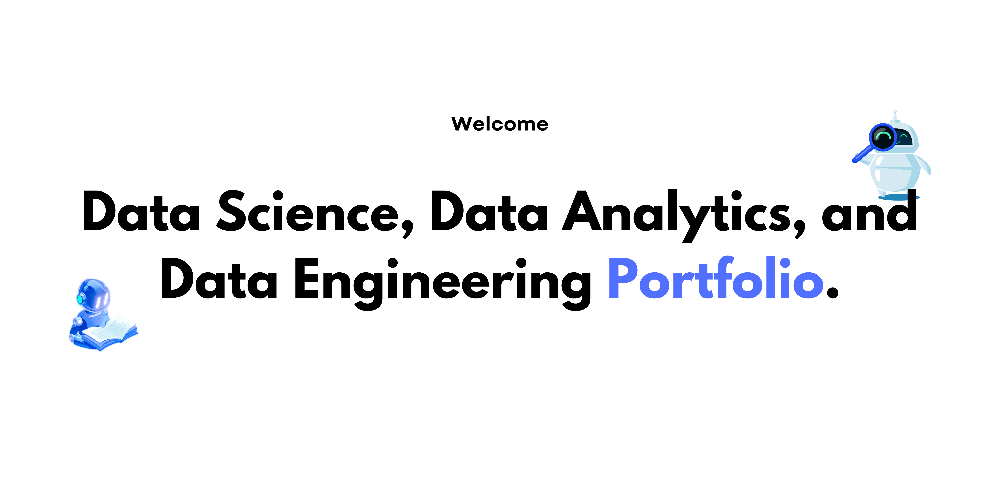

# Kostanca Kovaci | Data Science Portfolio

MSc Data Science graduate (Distinction, Middlesex University) with a Physics background, specializing in machine learning, BI, and NLP. This repository collects my applied projects, from deployed ML apps to fairness audits of large language models.

📫 

 

---

## Featured Projects

| Project | Description | Stack | Link |
|---|---|---|---|
| **Customer Churn Prediction** | Deployed ML app predicting customer churn (0.88 ROC-AUC, 89% recall); tuned decision threshold for business use | Python, scikit-learn, Streamlit | [View](./churn-prediction) |
| **AI Bias Detection in LLMs** | Audited gendered/geographic bias in GPT & Claude against 1.6M+ reviews and crime data; MSc dissertation, Top 5 Poster Award | Python, SentenceTransformers, BERTopic | [View](./llm-bias-audit) |
| **E-commerce Data Quality Pipeline** | 14-rule validation system raising a 371K-row dataset's health score from 22 to 91 | Python | [View](./data-quality-pipeline) |
| **Retail Sales Optimization Analysis** | Three linked Tableau dashboards analyzing €84.5K in revenue, surfacing seasonality and margin insights | Tableau | [View](./retail-sales-optimization) |
| **E-Commerce SQL Analysis** | Normalized PostgreSQL schema; CTEs and window functions for customer/sales analysis | PostgreSQL, SQL | [View](./ecommerce-sql-analysis) |

## Additional Projects

Smaller or earlier-stage work: NLP classification, EDA, dashboards, and predictive modeling is organized in [`other-projects/`](./other-projects).

---

## Skills demonstrated across this portfolio

- **Machine Learning:** classification, regression, feature engineering, threshold tuning, model evaluation
- **NLP:** text classification, SentenceTransformers, topic modeling (BERTopic), fairness auditing
- **Data Engineering:** ETL pipelines, data validation, relational database design
- **BI & Visualization:** Tableau, Power BI (in progress), dashboarding
- **Languages/Tools:** Python, SQL, Git, Streamlit, AWS

---

⭐ If you find any of this useful or want to discuss a project, feel free to reach out.
